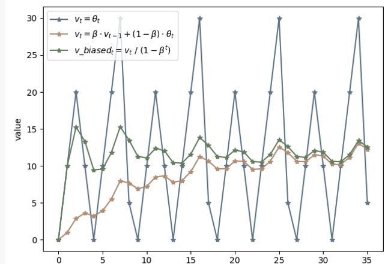

# 前言
本文将深入讨论现今后端服务关于负载的测量、优化、治理手段，通过对比分析TCP-BBR技术核心痛点，进而带读者尽可能理解并掌握自适应限流技术。

# 背景
负载（load)，通常与并发关系密切。对于后端服务而言，任意时间内的并发用户访问都会提升服务负载，进而进一步消耗计算资源。然而计算资源是有限的，如CPU、memory、network等等，过载将会导致服务性能下降，进而回复滞缓甚至不可用。描述服务应对日益增长的负载的能力称之为***Scalability***， 即可伸缩/扩展性。以下是DDIA（Designing Data Intensive Application）中的解释：
> Scalability is the term we use to describe a system’s ability to cope with increased load

# 测量负载

## 负载的具体指标
为了提升可扩展性，我们第一步要做的是固定资源下对服务请求接口进行测试，进行服务能力上限评估以及相应优化。显然，单纯将并发用于对负载的测量是不够具体的。对于后端服务，我们会进一步关注以下两个指标。
### 负载因子(load parameter)

    
  **本服务中最能引起现负载增加的指标**。对与web服务而言，显然就是每秒请求数QPS；对于数据库等服务来说，可能就是读写率的上升。

### 关键结果(performance number)
  
    

  **本服务负载增加时最需要关注的指标**。对与web服务而言，显然就是用户的等待时间即respond time/latency；对于数据库等服务来说，就是对吞吐率的影响。

## 性能观测
以web服务为例，我们通过增加请求数来收集对应的时延消耗如下图。其中X轴表示请求的数量，Y轴表示对应消耗的时间。其中，每次请求所消耗的时间通过灰色柱如所示。从实践经历来看，同类型的请求每次消耗的时延会受到多种因素的影响，因而都不是固定的。（后文会详细解释）
    
所以，单纯将总请求数/总耗时的平均结果不具代表性。为此业内广泛使用百分位数，又称水位线来表示用户实际经历的时延情况。
### p `N` th

其中N表示百分比，例如图中95th，又称95线。假设95线对应的时延为1.5s，总请求数为100， 那么**p95**就表示在100个请求中有95个请求的时延小于1.5s。

在大型后端服务中，工程师会更倾向于关注高水位线如99th下的时延分布，因为这是最直接对用户产生影响的**关键结果**。

### 定位优化
  
通过水位线获得的时延分布可以针对性的优化相应接口逻辑，以尽可能减少业务层导致的延迟较大的问题。如优化代码数据结构、缓存部署、数据隔离以提高命中率等等。

## 资源与性能瓶颈

请求时延的增高不仅与业务逻辑有关，在有限的硬件资源下(cpu、memory、带宽)，负载升高同样会进一步影响用户请求时延。在对预期正常流量下的请求表现出的时延进行业务优化后，我们还需要对服务进一步压测以至**过载**情况下服务对请求的响应情况，尽可能找出负载上限，保护服务。

### 压测视图
  
  
当我们使用压测工具一步步加大强度时，关于负载各项指标的宏观理想变化基本如上图所示。其中**红色曲线**表示每秒请求被处理的用户数TPS（throughput per second），**蓝色曲线**表示对应请求时延，X轴表示QPS量。

可以直观的看出：
1. 初始阶段

随着QPS的上升，TPS也在逐步提高，时延相对稳定。因为此时CPU和内存等计算资源相对充裕，请求在系统中无需排队就可以处理。

2. 瓶颈阶段

当QPS加大到对应TPS曲线顶点附近时，此时计算资源负载接近满额，服务中的请求处理出现排队情况，时间非线性上涨。

3. 过载阶段
  
此时进一步加压QPS，计算资源超额负载，进一步导致GC、进程调度、网络等资源压力导致TPS迅速下降，同理请求排队过长导致时延进一步类指数级上升，最终导致服务资源耗尽出现宕机无响应等情况。
 
直观来看，由于固定计算资源的限制，当QPS加压超过TPS峰值时系统的处理能力会被反噬。从服务保护、资源利用的角度，我们会认为**将TPS顶点附近值作为对QPS的限制阈值**相对理想。

# 过载保护
本节将着重介绍基于具体阈值的限流办法以及相关的局限性，提出服务稳定前提下的核心预期。
## 基于QPS阈值的限流
在很长一段时间内，工程师都会采用上述阈值作为服务的兜底QPS限制以防止过载。此时就出现了优秀的限流算法，即令牌桶（Token-bucket）和漏桶（leak-bucket）以及众多衍生。
  
互联网上关于这两种算法原理的介绍多如牛毛，在这就不再赘述。总的来说，桶算法对流量提供了整形的功能，以防止瞬时流量等极端情况打垮服务。在小规模后端服务而言基于阈值的限流方式简单高效，能够应付绝大多数问题。

## 基于具体阈值的局限性
上节在进行阈值测量时，对测试的整体描述为**理想情况**下。这意味着在大规模分布式系统中，测量结果从工程的角度忽略了很多必要细节。这其中包括测试方式、硬件资源配额、线上scale、服务环境、阈值可用性等等众多情况。

### 测试之痛
现如今后端领域已经进入了云原生时代，微服务架构早已经是事实标准。其中通讯方面是以典型的事件驱动方式（Event-driven），这表示所有的请求都是通过RPC即以接口调用的方式实现的。一个合理划分的微服务，在稍具规模的情况下拥有的接口数量保守估计至少是在十位数以上，因此对接口级别、服务级别的阈值获取将变得相当繁琐和困难。在Netflix的技术博客中，他们使用`arduous task`来形容测试的艰巨。
- 接口压测
  
  如前文提到的，即使是同一个接口，每轮压测的结果也会有差距。这是因为机器资源在测试中同时会受到垃圾回收、线程/进程资源抢占、磁盘I/O抖动、网络带宽质量等因素的影响。在服务级别的测试、线上环境中，此类问题会被进一步放大。为此，测试人员不得不多次测量求个均值以求准确。

- 服务级压测

    不同接口显然对资源的消耗程度不同，因其包含读、写、下游扇出等各种情况时延也会产生差异。对于服务级别的限流阈值确定可以说是相当困难，因为基于接口级的阈值组合会在不同用户请求不同接口时产生波动。为此进行流量录制并全链路压测虽能够阈值的范围，但仍无法做到精准，且成本过大。
### 维护之痛
所有测试以及线上环境中，最关键其实是计算资源的配置。所测试机器的CPU核心数和内存等配置时刻影响着测试结果。再者，如今基于容器网络如k8s的自动资源scale能力，会使得基于具体数字的阈值设定难以维护。再者，秒级的流量限制显然对于100ms内突发流量洪峰无法做出有效干预，导致服务异常过载。
- 干预成本
 
  当无论遇到线上激增流量机器指标异常、自动扩容等导致阈值不再适用，进而要增加或者减小时，工程师从发现问题到上机操作发布配置的耗时已经错过了干预的最佳时机。

- 认知负担

    从上述测量流程来看，工程师必须对计算资源、接口业务、容器配合、调度时机等各方面有足够认知才能应对各种流量突发状况，显然会消耗大量的精力和时间。

综上所述，基于具体数字的阈值方式在大规模后端服务中会进一步捉襟见肘，可延展和可伸缩性较差。

## 过载下的服务预期
在讨论进一步的解决方案之前，我们要明确在负载加大时对服务情况的**预期**。 即在使服务不垮掉情况下，充分利用计算资源服务用户。结合具体的负载因素预期如下：
- 尽可能多的处理request，即高TPS
- 尽可能快的处理request，即低时延
- 尽可能使得request不产生堆积，当前计算资源下存在的最佳处理量
  

很明显，想要同时获取上述指标是相悖的。对于高TPS，意味着尽可能要将计算资源利用，请求产生拥塞进而导致**关键结果**——时延的指数上升；对于时延，那么就尽可能需要服务中处理的请求相对宽松。虽然时延低下来了但同时TPS也会很低，造成计算资源的浪费；对于服务进程中的请求最佳处理量，结合各种变化因素也不好确定。那么有最佳的解决办法吗？

# 传输层自适应拥塞控制
本节将引出传输层TCP-BBR算法要解决的问题，以及和我们上述服务预期问题的同质性。进一步挖出共点
## 传输层TCP现状
TCP是面向字节流保序的传输层协议。在面对未知的网络中转节点以及对端网络状态，如果最大化利用网络带宽是其要面对的首要问题之一。为此，应运而生了经典的拥塞控制算法。
  
上图是传统的基于丢包检测的拥塞控制算法，代表有CUBIC、RENO等实现。详细解析已经超出本文的讨论范围，此处简述基本原理以及其核心特点。其控制周期基本上有四个组成部分，分别是慢启动、拥塞避免、快重传、快恢复。其中CWND表示拥塞窗口，也就是可以向网络中一次性发送的数据量，最终窗口大小由其与对端接收窗口中的较小值来决定。

在不考虑对端窗口的影响下，由于网络状况未知，算法会依据不同状态针对性的加大CWND窗口的大小。当出现丢包时CWND大小会大幅度减小，如图中陡降部分所示。在后续的优化重传等策略之下，仍然能够看到当出现丢包时CWND的减幅程度十分明显。
## 基于丢包的控制算法局限

  
该类算法的核心思想在于对丢包数据的测量，然而在现代网络设施的发展下某些场景如长肥网络（高延迟、高带宽）等已经不再适用。结合上图，由于路由节点的buffer大小日益增长，同时增加了数据包在队列中等待时间。再加上多跳路由节点的计算、传输等能力的不同会很容易导致CUBIC等算法的认为丢包，采取锐减CWND窗口的行为。也就说当开始介入拥塞避免时，拥塞早已发生且会进一步负反馈导致吞吐下降。也就是说，基于检测**丢包**信号这单一指标来衡量拥塞达不到最优解。

## 基于真实的网络负载特点分析
显然网络拥塞的发生同样是由各个路由节点网络负载升高产生的，既然是负载，那么就需要对其具体负载指标的分析。
### 负载因子
抛开网络拓扑现状的复杂性，能够首要引起网络负载升高的显然是网络流量的增加。那么，对应的指标就是网络**Bps**（bytes per second），即每秒的数据传输量。

### 关键结果
面对负载Bps的增加，会影响到的关键结果就是网络传输的往返时延**RTT**（Round-trip time）上升，导致传输拥塞。

### 传输观测
下图是理想情况下网络设备在传输过程中的负载变化图，上半部分为流量传输速度（Delivery rate$\approx$Bps）和对应时延（RTT）的变化，下图为对应网络设备的物理状态变化。分为三个阶段：

  

1. 初始阶段
 
初始阶段网络设备中的队列为空，数据包无需排队。随着发送速率的增加RTT保持稳定。

2. 瓶颈阶段
 
此时排队已经逐渐形成，设备的传输吞吐能力即带宽达到上限，保持稳定。对于RTT而言，由于排队的原因逐渐增加。

3. 拥塞阶段

此时网络设备的队列已经被流量完全打满，多余的数据包被拒绝，进一步导致RTT大幅上升。

从图中红圈标注的RTT和传输率折线图出看到，RTT在瓶颈阶段开始大幅度上升，传输速率在该阶段同样达到了瓶颈即带宽上限。可以看出，从此处开始拥塞就要发生了，然而基于丢包的拥塞控制算法反而在上述第三阶段才能够生效，这显然滞后太多了。

### 最佳预期

从上述理想分析，我们相对确定出了在一波数据传输过程中RTT的下限，即minRTT；数据传输带宽能达到的上限 max BW（max bandwidth）。对于这两个网络层的负载指标，至今已经有了很成熟的衡量体系，在网络传输中其关系如下图所示。

  
我们可通过 **网络节点每秒传输数据的能力**即带宽（bandwidth）**乘** **数据包在节点中的传输处理时间时延**（即latency$\approx$RTT）的结果作为网络上正在处理的报文数量，即**带宽时延积BDP**。BDP决定了需要向网络中发送的数据包量。

综合上述，我们可以确定理想情况下向网络传输数据的最佳数量：
  `BestBDP = maxBW * minRTT`

显然，我们应对负载的关键指标测量已经不仅要关注**关键结果**，还与**负载因子**进行综合。相对的，多年来基于丢包的拥塞控制算法都只关注了**时延**这单一指标。

虽然有了理论预期，但同样出现摆在工程师面前的难题：**如何在拓扑结构复杂，路由情况多变的网络环境中测得这两个指标？** 这个测试过程本质上和上节我们提出的业务负载预期指标相悖论如出一辙。那么该如何解决这一难题呢？接下来就是BBR登场的时刻。

## TCP-BBR算法
BBR（Bottleneck Bandwidth and Round-trip propagation time）是Google近年来提出的拥塞控制算法，从而大幅度提高了在高延迟等情况下网络传输的吞吐。从命名就可以看到带宽（Bandwidth）和往返时延（Round-trip time)关键字，在上述铺垫过程中，对应的就是**maxBW**和**minRTT**。对于多变的网络环境BBR大胆的采用了**以预期公式驱动，实时交替探测两个负载指标的办法**，下文会对此详细解释。

### 算法核心解读

BBR认为：既然网络多变，且最佳带宽和时延不好同时测量，那么就采取实时交替探测的方式。通过滑动窗口细粒度的交替收集一段时间内的每秒最大传输量和最小的RTT，通过计算就可以获得目前最佳的BDP。
即 
`BestBDP = BtlBw (bottleneck bandwidth) * RTprop (round-trip propagation time)`

- BtlBw

表示目前网络中的瓶颈带宽，也就是上节中的maxBW，是网络设施传输的上限。BBR会取得一段时间内滑动窗口的统计的最大BtlBw值作为参考。其测量方式简述为一段时间内的数据包总量除以他们所抵达花费的时间。

- RTprop

表示抛开任何外在噪音，如ack重发耗时，网络抖动等等导致RTT偏高情况。即在滑动窗口统计中的RTT最小值作为参考，其测量方式为数据包发送和回复耗时。

- inflight

这指的是，在BBR工作期间内，已经发送至网络但是还是没有收到答复的数据包。也就说真实的，在网络设备里正在传输的数据量，即负载。有了预期公式计算出的BestBDP指导将RTprop与BtlBW相乘，BBR就可以得出**当前时刻外界网络最佳的负载量与实际inflight的关系**。有了这样的简单的数值比对，算法就可以控制发包的最佳量以进行拥塞控制。

以下伪代码直观的体现了BBR算法在发包和收包时的处理逻辑。
- 收包 onAck
    

- 发包 send
  

### 算法组成

了解了核心的算法逻辑，接下来将简述其运作周期，进一步了解算法是如何充分利用未知网络设备传输能力的。
算法运行状态主要分为启动阶段（Startup）、排空阶段（Drain）、带宽探测（ProbeBW）、时延探测（ProbeRTT)。同样，本文将不会阐述具体细节，具体细节可以参考文末的reference。我们回到核心关注点，BBR是如何探测以及适应当前网络设备传输能力的。

  
上图摘自google BBR论文，展示了在稳定网络传输节点下BBR算法中关键指标RTT、BW、inflight的变化图。其中灰色**cycle gain**数组，相当于滑动窗口。其中每个元素装载了带宽探测时的增益系数，通过与当前最大BW相乘可以实现增加/减少向网络中的数据发送，从而实现适应未知网络传输能力目的；同理，对于时延探测，简单来说BBR同样会周期性的发送小体量数据包收集最佳RTT。

可见，基于预期的负载控制算法，即同时集合负载因子和关键结果的计算，相比只关注一个指标的实现方式在高吞吐场景下具备一定的优越性。同时，基于滑动窗口细粒度的动态探测极值，使得测量结果更具时效性与说服力。

# 自适应限流算法
经过上面长篇大论的分析和讨论，我们终于到了本章最为核心的自适应限流算法介绍。目的在于找到应用层与传输层面对负载、过载情况应对措施的共同点，以及如何应用于后端服务。

## 负载在传输层的同质性
综合来看，传输层在面对网络负载的测量、治理、实施历程与应用层负载有很多共同点，如下表所示。

|  | 传输层 | 应用层 |
| :-----:| :----: | :----: |
| 负载因子 | Bps | Qps |
| 关键结果 | RTT | latency |
| 加压负载因子时处理端表现| delivery Rate（带宽传输速率）上涨直至瓶颈 | TPS上涨直至瓶颈，由于进程资源抢占等压力会进一步反噬下跌 |
| 加压负载因子时关键结果表现 | RTT从理想稳定状态升高至瓶颈，伴随拥塞指数上升| latency请求等待时延理想情况下至瓶颈期处于稳定状态，伴随排队导致服务过载指数上升 |
| 核心预期 | 尽可能大利用网络传输带宽，即最大传输速率maxBW；最小的包等待RTT；不拥塞前提下最佳发包量BestBDP | 尽可能多的处理请求，即高TPS；尽可能快的处理请求，即低时延；极可能充分的利用服务计算资源，不产生堆积的数量 |
| 核心需求 | 能够得到网络设施的最佳处理数据量，以避免拥塞且实现高吞吐 | 能够得到服务进程在当前计算资源下的最佳请求处理量，以避免请求排队资源抢占实现高吞吐，进一步保护服务防止过载|
| 难点 | 无法同时测量最佳带宽和最低时延，基于复杂的网络拓扑和设施数量难以确定数值 | 无法同时测量最佳TPS和最佳latency，众多接口耗时不同，且包含进程GC、网络抖动、资源scale多变的情况下基于服务级别的限流数值不好确定 |
| 历史阶段 | 基于RTT耗时检测，即丢包认为网络发生拥塞进行干预 | 基于压测得到的qps阈值作为限流标准 |
| 现阶段 | TCP-BBR | Sentinel、Kratos ……|

（我们会在后文介绍sentinel与kratos）
### 利特尔法则
通过上表可看出应用层和传输层在应对负载时本质需求是相同的，那么关于应用层的核心预期公式的推导显然具有相似性，那就是最佳请求数`TW（当前最佳处理任数目） = TPS * latency`。如下所示
  

其实这个公式的依据是显赫有名的利特尔法则little's law，为通过对工业中平均生产数量和对应耗时提供了理论基础，以进一步衡量生产能力。

### 基于TCP-BBR的自适应算法
我们已经具备充分的理论基础和传输层实现指导，下一步就是因地制宜的实施在应用层后台服务。在业内最初版目前所知是由阿里的sentinel组件引入，由kratos进行了进一步拓展。
在此我们需要搞清楚两个关键问题，才能保证最大化吞吐的同时防止服务过载。

- 控制时机

BBR作为数据发送方，需要面临的问题**未知**网络设施传输能力。由于网络设施的传输能力、拥塞状态对发送方是非直接可见的，所以才有了上文提到的BBR带宽**探测**。滑动窗口内通过cycle gain变化，来适应不同时刻的传输能力。

应用层作为请求处理方，无论是在容器网络和物理机上部署，计算资源是相对**固定**的。这意味着存在着最佳处理量上限，我们要保证的是在流量上升或者因为其他因素导致计算资源紧张时，通过计算出的最佳TW来**限制入口流量**。

- 控制信号

了解了控制时机，可就是当计算资源紧张时进行干预。那么该如何确定资源紧张信号呢？总的来说就是CPU利用率或者操作系统负载，或者内存、磁盘等资源。以入口流量特征来看（进程RPC调用下游服务按照业务需求进行组装、计算、返回），无论时内存资源不足导致的GC（依赖CPU）、磁盘I/O吞吐下降、调度抢占等等因素，都会导致用户请求增加、序列化成本增加（CPU）进而时延上升恶性循环。所以在sentinel和kratos的实现中都选择了适用CPU作为资源信号限流，只不过前者使用的是cpu load1，后者使用的是服务基于cgroup对CPU的实时采样使用率。

两者使用各有千秋，但我们认为，基于load1作为控制信号仍不够敏感。在linux下操作系统load1表示一分钟内CPU的平均负载值，对于流量洪峰等过载的发生干预有效性较慢。

### 具体方案
*本部分屏蔽到绝大部分代码与设施细节，关注应用方式与过程中上线效果、遇到的问题以及优化。基于bbr算法的完整kratos代码可进入referenc阅读*

- CPU利用率峰值信号

kratos以是当前容器网络服务CPU利用率的80%作为控制信号临界点，通过为此服务会开启独立的goroutine每隔250ms进行基于本服务的cgroup(`/sys/fs/cgroup/cpu/*`)CPU占用信息采集，以及系统总cpu tick（`proc/stat`)占用采集。

对CPU占用率的计算本质是间隔内 **本进程占用的CPU时间增量/系统的总CPU时间占用增量**。
显然CPU的变化是相当迅速的，会受到各种因素的影响来回抖动动。为此我们采用了滑动均值（[算法原理参考](https://blog.csdn.net/m0_38106113/article/details/81542863)）的办法进行降噪稳定。通过确定参考衰退率β(<1)，使得最终结果等于：`β*上次的CPU占用率 + (1-β)*本次的时机测得CPU占用率`。如下所示：
  
1. 深蓝色折线代表了正常实际测量下CPU的变化折线图，可以看到抖动十分不稳定。
2. 橘色公式折线表示了在滑动均值算法下趋于平稳变动的CPU变化图，但是能看到前提CPU数值较低。
3. 绿色公式折线是在具体滑动均值算法作用下，对前期数据量不足导致CPU起点低的问题进行的**偏差修正**。

最终经过上述修正，我们得到线上具有参考使用价值的CPU占用率。

- Pass&RT

pass和RT分别表示处理完成请求数和对应请求所消耗的时间，即TPS和Latency。相应的，我们的测量办法同样是通过滑动窗口对pass和RT进行统计，如下图。
  
sample window表示窗口采样周期，sample bucket表示周期内的采样批次。假设现在采样窗口时间为1000ms，bucket采样批次时间持续500ms，那么就表示在前500ms内完成的请求数和这些请求消耗的平均时延都会被原子（atomic）统计在bucket1中。同理，当第501ms会被统计在bucket2中，当第1001ms时会再次回到bucket1，以此类推。可见当bucket足够多，以及统计间隔足够小时最能够得到真实的数据，更有效的应对秒内流量洪峰。

- 流量干预

当CPU利用率过载时，就需要通过预期公式进行干预了。我们会在服务运行期间持续统计当前服务的请求数，即inflight，通过在滑动窗口内的所有buckets中比较得出最多请求完成数maxPass，以及最小的耗时minRT，相乘就得出了预期的最佳请求数maxFlight。通过inflight与maxFlight对比，如果前者大于后者那么就已经过载，进而拒绝后续到来的请求防止服务过载。

### 线上效果与调优

  
上图是在线上部署了基于kratos的自适应算法后的效果图，其中颜色线代表了并发访问的用户数，深黄色代表对应请求的时延，浅绿色则表示成功处理的请求数。左侧为最终版，右侧为第一版。

不难看出，第一版时当算法控制后黄色的时延仍然很高，成功处理的请求数也并非稳定。产生这样结果的原因其实依然是CPU利用率很敏感且粒度很细，当CPU大于80%利用率阈值时算法生效，当微量请求被拒绝时算法便停止了干预。最终的结果便是算法会因为流量的涌入与拒绝中频繁开启与关闭，导致结果不符合预期。

- 优化手段

为此我们简单加入了1s的冷却时间，也就是说算法开启后会持续至少1s的冷却时间，再次期间保持算法开启。当冷却时间过后会再次统计当前CPU利用率，并根据阈值对比进行持续或者关闭。最终测试结果如最终版左图所示，在流量持续涌入的情况下请求的成功处理数和时延都十分稳定。

# 后记

本文尽可能通过应对负载的迭代历程优劣分析，抽丝剥茧完整的引出基于TCP-BBR的自适应算法实现与优势。自适应过载保护同样不是完美的，一方面在请求等排队过长的情况下虽然计算资源未满载，但是同样增加了等待时间。为此，可以选择结合排队论相关算法如[CoDel](https://blog.csdn.net/dog250/article/details/72849893)进行干预；另一方面，在极端流量的涌入下可能单纯的拒绝回复成本就会打垮CPU，从而导致宕机，此时可以参考reference中google sre里的自适应熔断等策略合力保障服务的可用性。

另外，对于自适应限流技术的发展，从Netflix最早基于传输层vegas的限流手段推出中间件`concurrency-limits`， 再到如今基于TCP-BBR的自适应限流算法改进与实现，都体现了很强的发散性和优化空间。期待读者的进一步讨论！

# Reference
https://sre.google/sre-book/handling-overload/

https://sentinelguard.io/zh-cn/docs/system-adaptive-protection.html

https://netflixtechblog.medium.com/performance-under-load-3e6fa9a60581

https://blog.csdn.net/m0_38106113/article/details/81542863

https://github.com/go-kratos/kratos/tree/v1.0.x/pkg/ratelimit/bbr

https://queue.acm.org/detail.cfm?id=3022184

https://www.net.in.tum.de/fileadmin/bibtex/publications/papers/IFIP-Networking-2018-TCP-BBR.pdf

https://blog.csdn.net/dog250/article/details/72849893

https://blog.csdn.net/russell_tao/article/details/98723451

Golang进阶训练营之微服务可用性设计-毛剑